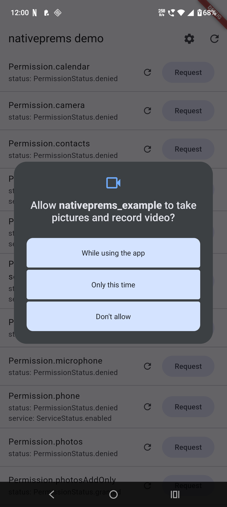
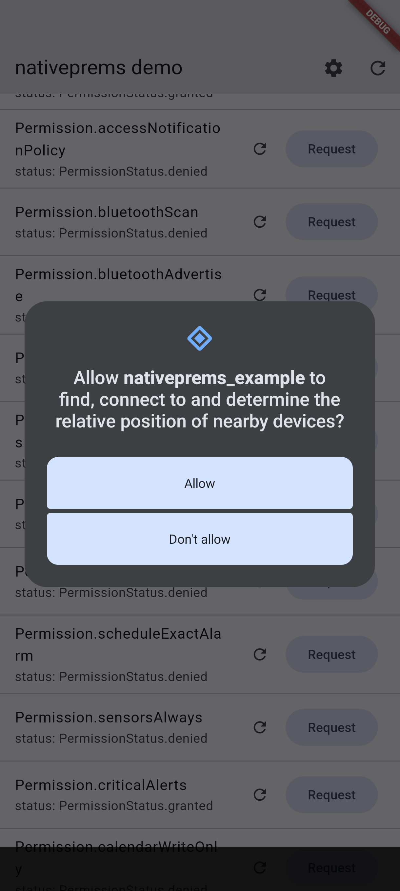
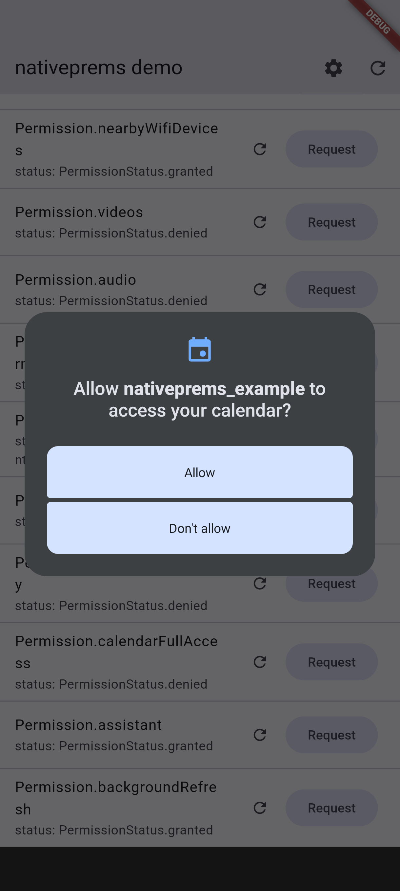
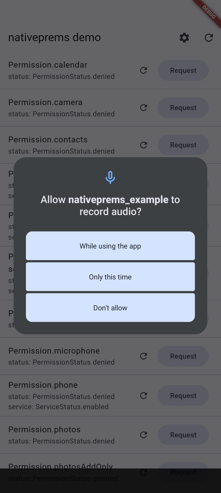
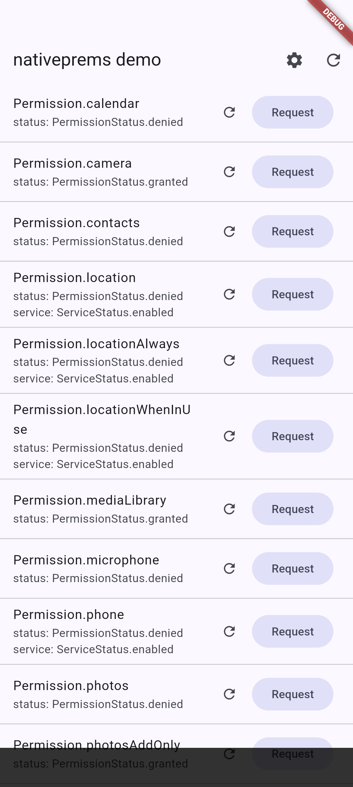

# nativeprems

`nativeprems` is a Flutter permissions plugin with native iOS Swift Package
Manager support.

Use it when your Flutter app needs to check permission status, request runtime
permissions, inspect service availability, or open the platform app settings
screen from Dart.

## Preview

| Camera permission | Nearby devices permission |
|:---:|:---:|
|  |  |
| Calendar permission | Microphone permission |
|  |  |
| Demo permission list |  |
|  |  |

## Features

- Simple Dart API for checking, requesting, and handling permissions.
- Single public import: `package:nativeprems/nativeprems.dart`.
- Check one permission or request multiple permissions at once.
- Service status checks for permissions backed by a device service, such as
  location, bluetooth, and phone.
- `openAppSettings()` helper for guiding users after a permanent denial.
- Flutter plugin support for Android, iOS, web, and Windows.
- Native iOS implementation is available through Swift Package Manager.

## Installation

Add the package to your Flutter app:

```yaml
dependencies:
  nativeprems: ^0.1.0
```

Then import it:

```dart
import 'package:nativeprems/nativeprems.dart';
```

## Swift Package Manager availability

The iOS implementation is packaged as an SPM package in:

```text
ios/nativeprems/Package.swift
```

The package exposes a `nativeprems` library target and requires iOS 12.0 or
newer. Flutter users normally do not need to add this package manually; Flutter
registers the plugin from your `pubspec.yaml` dependency.

SPM support is useful when you need native iOS tooling to resolve the plugin
source cleanly, or when your iOS build flow prefers Swift Package Manager over
manually managed native source.

## Platform setup

Declare only the permissions your app actually requests.

### Android

Add the matching permissions to your app manifest:

```xml
<manifest xmlns:android="http://schemas.android.com/apk/res/android">
    <uses-permission android:name="android.permission.CAMERA" />
    <uses-permission android:name="android.permission.RECORD_AUDIO" />
    <uses-permission android:name="android.permission.ACCESS_FINE_LOCATION" />
    <uses-permission android:name="android.permission.POST_NOTIFICATIONS" />
</manifest>
```

Some Android permissions are version-specific. For example, media permissions
changed on Android 13, and notification permission is runtime-gated on Android
13 and newer.

### iOS

Add the required usage descriptions to your app `Info.plist`:

```xml
<key>NSCameraUsageDescription</key>
<string>We need camera access so you can take a profile photo.</string>
<key>NSMicrophoneUsageDescription</key>
<string>We need microphone access for voice messages.</string>
<key>NSLocationWhenInUseUsageDescription</key>
<string>We use your location to show nearby stores.</string>
```

iOS will terminate the app if you request a protected permission without the
matching usage description.

## Usage

### Check a permission

```dart
final PermissionStatus status = await Permission.camera.status;

if (status.isGranted) {
  // Continue with camera-only work.
}
```

### Request a permission

```dart
Future<void> requestCamera() async {
  final PermissionStatus status = await Permission.camera.request();

  if (status.isGranted) {
    // The user granted access.
    return;
  }

  if (status.isPermanentlyDenied) {
    await openAppSettings();
  }
}
```

### Request multiple permissions

```dart
final Map<Permission, PermissionStatus> statuses = await <Permission>[
  Permission.camera,
  Permission.microphone,
  Permission.locationWhenInUse,
].request();

final bool readyForVideo = statuses[Permission.camera]?.isGranted == true &&
    statuses[Permission.microphone]?.isGranted == true;
```

### Check service status

Some permissions also expose device service status. A simple example is
location: permission can be granted, but location services can still be turned
off at the system level.

```dart
final PermissionStatus permission = await Permission.location.status;
final ServiceStatus service = await Permission.location.serviceStatus;

if (permission.isGranted && service.isEnabled) {
  // Location permission is granted and the device service is enabled.
}
```

### Show Android request rationale

```dart
final bool shouldExplain =
    await Permission.camera.shouldShowRequestRationale;

if (shouldExplain) {
  // Show a small explanation in your UI before requesting again.
}
```

On iOS, web, and Windows this returns `false`.

### Open app settings

```dart
final bool opened = await openAppSettings();
```

Use this after a permission is permanently denied and the user must change the
permission from system settings.

## Supported permissions

The public API exposes `Permission` constants including camera, contacts,
location, locationAlways, locationWhenInUse, mediaLibrary, microphone, phone,
photos, photosAddOnly, notification, bluetooth, bluetoothScan,
bluetoothAdvertise, bluetoothConnect, nearbyWifiDevices, videos, audio,
scheduleExactAlarm, calendarWriteOnly, calendarFullAccess, assistant, and
backgroundRefresh.

Platform behavior can differ because Android, iOS, web, and Windows expose
different permission models. Always test the permissions you use on the
platform versions your app supports.

## Migration note

The package name and public import path are `nativeprems`.

If you are migrating from an older local package name, update to:

```yaml
dependencies:
  nativeprems: ^0.1.0
```

```dart
import 'package:nativeprems/nativeprems.dart';
```

The native method channel is also named `dev.effdel.nativeprems/methods`.
Rebuild the app and embedded plugin artifacts together after upgrading. Do not
mix old Dart artifacts with new native binaries, or old native binaries with
new Dart artifacts.
